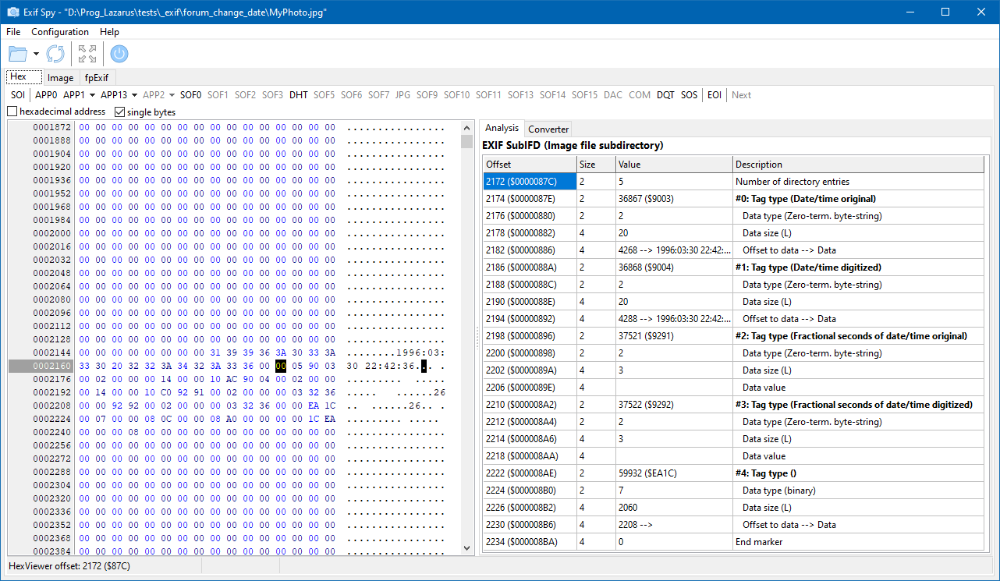

# ExifSpy
Tool for peeking into the binary structure of exif metadata of picture files.

## Features

* Navigate through the jpeg file structure
* Navigate through the EXIF tag directories
* Display and analyze binary metadata records (EXIF, IPTC, XMP)
* Display and analyze jpeg ICC color profiles
* Embedded hex viewer combining the bytes beginning at the cursor position to conventional data types in both big endian and little endian byte order.

## Compilation

The application is distributed as Free Pascal source code only. It can be compiled with <b>Lazarus v2.0</b> or later.

Besides the packages <b>SynEdit</b> and <b>TurboPowerIPro</b> which are contained in the Lazarus distribution it requires the run-time package <b>fpexif</b> which is available via the Online-Package-Manager of the Lazarus IDE.

## Credits

- Free Pascal: https://www.freepascal.org/
- Lazarus: https://www.lazarus-ide.org/
- MPHexEditor: originally written by Markus Stephany, Lazarus port by Michal Gawitzky (https://github.com/michalgw/mphexeditor)
- Icons were provided by icons8.com (https://icons8.com/icons/ultraviolet).
